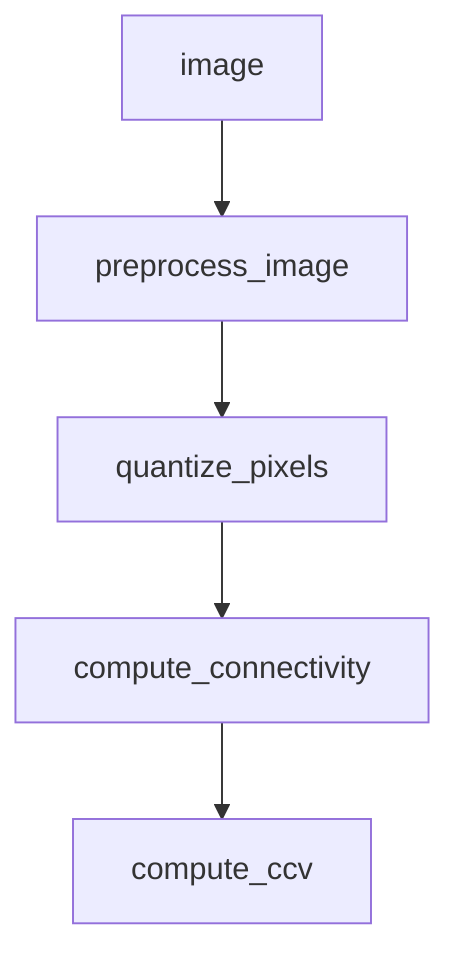

# Psuedocode for an algorithm to computer the color coherence vector of an image from a url

## Input
- url of image
- size to resie image to (optional)
- blur radius (optional)
- color space to quantize (optional)

## Output
- color coherence vector of image

# Files and Functions
## Preprocessing
- `preprocess_image(url, size, blur_radius)` - get pixels from image, resize it, blur it

## Color Quantization
- `quantize_pixels(pixels, color_space)` - quantize pixels into color space

## Connectivity Analysis
- `compute_connectivity(pixels)` - compute connectivity of pixels

## Color Coherence Vector
- `compute_ccv(pixels)` - compute color coherence vector from pixels

